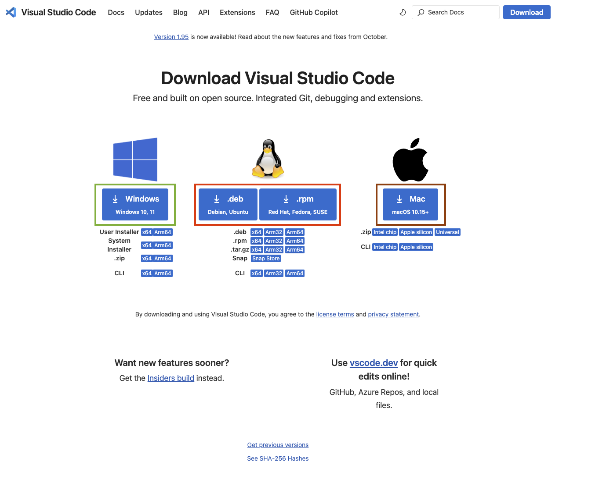
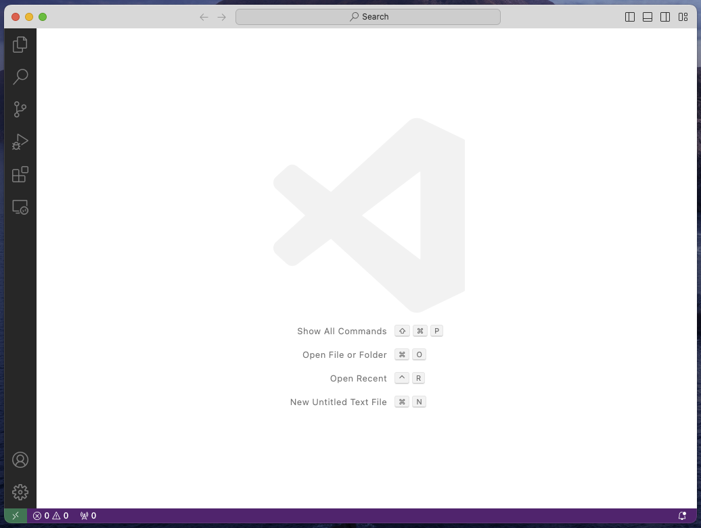
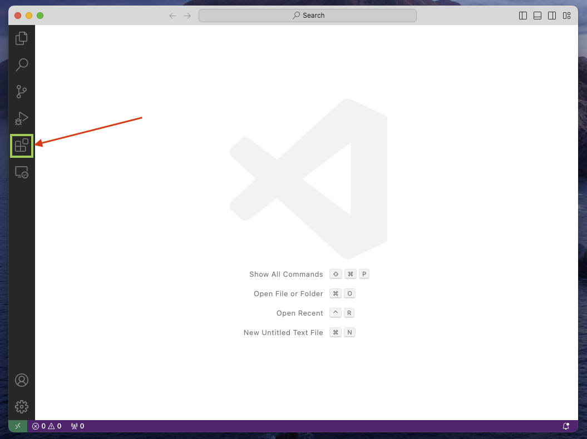

# Table of Contents

1.  [Setting up the basics]
    1.  [Virtual Studio Code (VS Code)]
        1.  [Step-1: Download and Install VS Code]
        2.  [Step-2: Install Essential VS Code Extensions]
        3.  [Step-3: Set up a coding directory]
    2.  [Great Work! We now have all items ready (1) VS Code platform to code, (2) ml4h directory to keep all codes safe.]
---

# Setting up the basics
## Virtual Studio Code (VS Code)
This document will help you install and setup the application VS Code and necessary utilities to smoothly run python and 
smoothly train machine learning models. Let's get started!
---
### Step-1: Download and Install VS Code
1.  Visit the [official VS Code website](https://code.visualstudio.com/).
2.  Download and install the version appropriate for your operating system.
    1.  Visit this [webpage](https://code.visualstudio.com/Download) for all versions for different platforms.
    2.  Please follow the square marked links to download for different platforms as shown below
        1.  Green box -> Windows
        2.  Red box -> Linux
        3.  Brown box -> Mac
        4.  
3.  Once downloaded (on MacOS) a file named something like &ldquo;VSCode-&#x2026;&rdquo; should show up in your Downloads directory
    
4.  Double-click and start the installation process. This will unzip the file and create an application file in the same directory.
    
5.  Double-click on the application. This will pop up a small window asking for permission if you want to open the application. There is nothing to worry about this. Go ahead and click Open.
    
6.  If this opens the application and looks something like the image below. Voila! Step-1 is DONE!
    
---
### Step-2: Install Essential VS Code Extensions
To install extensions that will help run all your programs:

1.  Click on the Extensions icon in the left (or press Ctrl+Shift+X)
    
2.  Search for all the extensions that you need (listed below) in the search box and start installing them.
    

Now, that we have the search box we can start setting up our application for some machine learning codes. To get started, install the following extensions:

1.  ****Python****: Provides Python language support. Make sure you install the &ldquo;microsoft.com&rdquo; version of the extension as shown below:
    
2.  ****Jupyter****: Enables working with Jupyter Notebooks. Once installed it should look like something like this:
    

Perfect! Now we have our setup ready.
---
### Step-3: Set up a coding directory
1.  Open VS Code and press Ctrl+` (The key present in the left top corner just below the Esc key)
2.  This will open a new terminal. Create a directory called "ml4h" by typing the following command
    ```
    mkdir ml4h
    cd ml4h
    ```
    
---
## Great Work! We now have all items ready (1) VS Code platform to code, (2) ml4h directory to keep all codes safe.